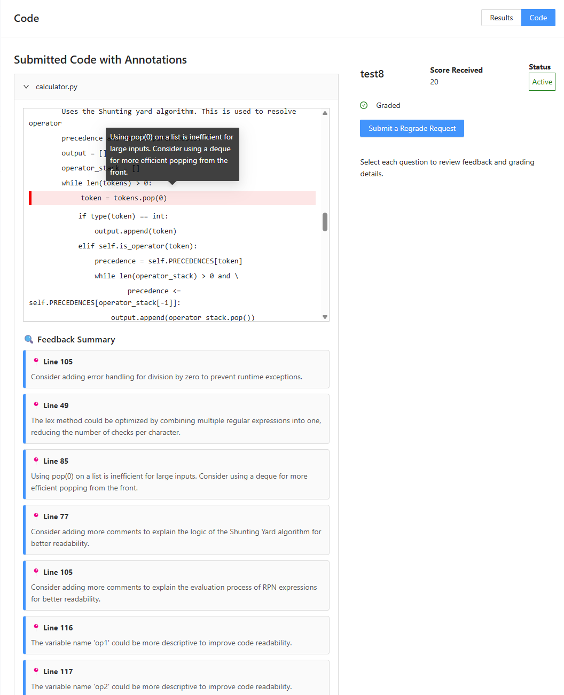
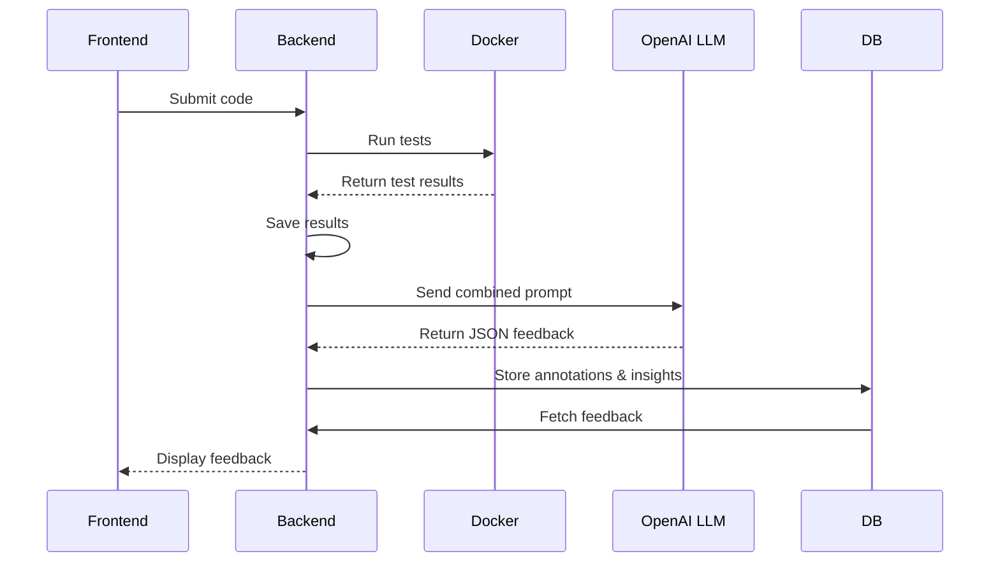

# AI Feedback Module

## Overview

CodeAssist integrates an AI-powered feedback engine that analyzes student code submissions and autograder results to generate targeted, actionable insights. The engine produces:

- **Annotations**: Line-specific comments focusing on correctness, efficiency, style, documentation, and error handling.
- **Insights**: High-level observations about recurring mistakes or areas for improvement. These are not visible to the student, and are used so that the AI can better tailor its future insights/feedback to target areas where the student needs improvement. Insights grow/adapt over time as the student continues to submit assignments and the student's coding behavior changes. 

## Enabling AI Feedback per Assignment

- By default, AI feedback is **disabled**. In the assignment settings (via the UI or API), enable feedback with the `ai_feedback_enabled` flag.
- If disabled, submissions will **not** trigger the AI feedback workflow for that specific assignment.

## Assignment-Level Configuration

For each assignments, instructors are able to configure the AI Feedback system:

- **Prompt** (`ai_feedback_prompt`): Base prompt guiding the LLM’s tone and focus.
- **Model** (`ai_feedback_model`): LLM identifier (e.g., `gpt-4-turbo`).
- **Temperature** (`ai_feedback_temperature`): Controls creativity vs. determinism (e.g., `0.5`).

> **Tip:** Tune these settings per assignment to adjust the depth, style, and specificity of feedback.

## Course-Level OpenAI API Key

- The OpenAI API key is scoped **per course**. In the Course Settings UI (or via the Courses API), set the `openai_api_key` field.
- The key is encrypted at rest using `API_SECRET_KEY` and decrypted at runtime when invoking the LLM.
- All assignments under the same course share this key, but use their individual AI settings.

## Feedback Workflow

1. **Submission**: Student uploads code; backend saves and executes it in an isolated Docker container.
2. **Autograding**: Tests run; results and logs are serialized into JSON.
3. **AI Trigger**: If `ai_feedback_enabled`, an asynchronous background task reads the code and results.
4. **Prompt Construction**: The system combines:
   - Assignment’s base prompt
   - Student’s past `coding_insights`
   - Current code and autograder results
5. **LLM Invocation**: Sends a JSON-formatted prompt to OpenAI.
6. **Parsing & Storage**: The JSON response is parsed; insights and annotations are saved to `Submission.ai_feedback` and `User.coding_insights`.
7. **Display**: Annotated code and updated insights are surfaced in the instructor and student dashboards.

## Example Data Flow

---

**Note:** Ensure the OpenAI key is configured at the course level before enabling AI feedback on any assignment. Tweak assignment-level parameters to optimize feedback quality and relevance.

