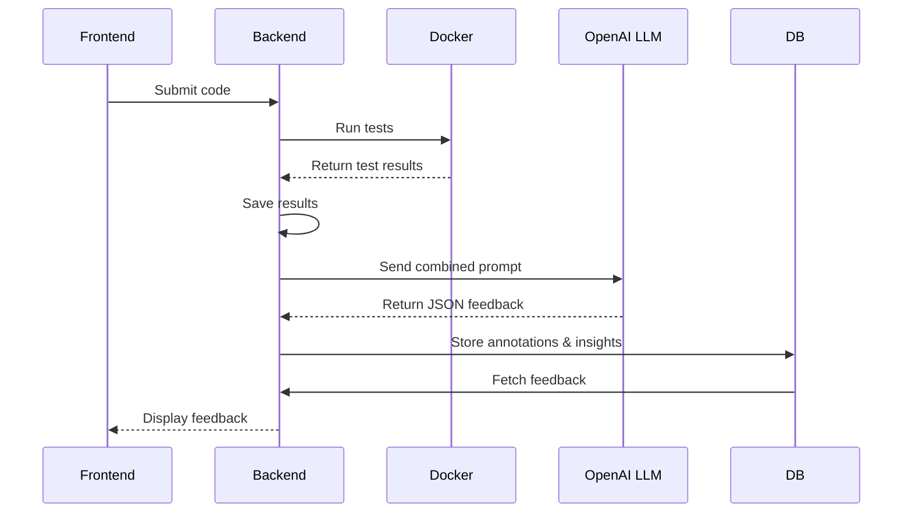

# AI Feedback Module

## Overview

CodeAssist integrates an AI-powered feedback engine that analyzes student code submissions and autograder results to generate targeted, actionable insights. The engine produces:

- **Annotations**: Line-specific comments focusing on correctness, efficiency, style, documentation, and error handling.
- **Insights**: High-level observations about recurring mistakes or areas for improvement. These are not visible to the student, and are used so that the AI can better tailor its future insights/feedback to target areas where the student needs improvement. Insights grow/adapt over time as the student continues to submit assignments and the student's coding behavior changes. 


## Enabling AI Feedback per Assignment

- By default, AI feedback is **disabled**. In the assignment settings (via the UI or API), enable feedback with the `ai_feedback_enabled` flag.
- If disabled, submissions will **not** trigger the AI feedback workflow for that specific assignment.

## Assignment-Level Configuration

For each assignments, instructors are able to configure the AI Feedback system:

- **Prompt** (`ai_feedback_prompt`): Base prompt guiding the LLM’s tone and focus.
- **Model** (`ai_feedback_model`): LLM identifier (e.g., `gpt-4-turbo`).
- **Temperature** (`ai_feedback_temperature`): Controls creativity vs. determinism (e.g., `0.5`).

> **Tip:** Tune these settings per assignment to adjust the depth, style, and specificity of feedback.

## Course-Level OpenAI API Key

- The OpenAI API key is scoped **per course**. In the Course Settings UI (or via the Courses API), set the `openai_api_key` field.
- The key is encrypted at rest using `API_SECRET_KEY` and decrypted at runtime when invoking the LLM.
- All assignments under the same course share this key, but use their individual AI settings.

## Feedback Workflow

1. **Submission**: Student uploads code; backend saves and executes it in an isolated Docker container.
2. **Autograding**: Tests run; results and logs are serialized into JSON.
3. **AI Trigger**: If `ai_feedback_enabled`, an asynchronous background task reads the code and results.
4. **Prompt Construction**: The system combines:
   - Assignment’s base prompt
   - Student’s past `coding_insights`
   - Current code and autograder results
5. **LLM Invocation**: Sends a JSON-formatted prompt to OpenAI.
6. **Parsing & Storage**: The JSON response is parsed; insights and annotations are saved to `Submission.ai_feedback` and `User.coding_insights`.
7. **Display**: Annotated code and updated insights are surfaced in the instructor and student dashboards.


## Example Data Flow



---

**Note:** Ensure the OpenAI key is configured at the course level before enabling AI feedback on any assignment. Tweak assignment-level parameters to optimize feedback quality and relevance.


## Implementation Details

The AI feedback engine is composed of several backend modules and frontend components:

### Backend Integration (`backend/ai_integration.py`)

- **Key Encryption**: Uses `encrypt_api_key` / `decrypt_api_key` with Fernet and the `API_SECRET_KEY` from `.env` to secure the OpenAI key. If the key is not defined in `.env`, it will just be saved as plaintext.
- **Data Fetching**: `fetch_submission_data` performs SQLAlchemy joins across `Submission`, `Assignment`, `Course`, and `User` models to retrieve all objects relevant to a given submission. 
- **Prompt Building**: `build_feedback_prompt` merges the assignment’s base prompt, the student’s past `coding_insights`, the submitted code, and autograder results into a single, structured prompt.
- **LLM Invocation**: `get_structured_feedback_from_openai` calls `client.chat.completions.create`, passing a system message and the constructed prompt, then parses the JSON response via `clean_ai_response`.
- **Asynchronous Execution**: `async_get_ai_feedback` runs in a background thread, pushes the Flask application context, reads the code and results, invokes the feedback pipeline, and calls `update_submission_feedback`.
- **Database Updates**: `update_submission_feedback` writes the parsed `annotations` and aggregated `insights` back into the `Submission.ai_feedback` and `User.coding_insights` fields before committing.
- **Model Response Format**: The model is expected to return a JSON response of the form:
```
"Response should be strictly JSON, with no extra formatting, in the form:\n"
        "{ 'insights': [...], 'annotations': [{pattern: ..., comment: ...}, ...] }\n\n"
```
- `insights` is an array of insights (string), while `annotations` is a series of regex patterns (references to lines of code), and the associated comment.
- This design is used in order to facilitate easily mapping comments back onto the code file in the frontend.

### Submission Endpoint (`submission.py`)

- Initiates the asynchronous AI feedback task after committing the submission record.
- AI Feedback is initially set to None in the DB, and is populated when the feedback is generated.
- The frontend will keep requesting information about the submission (approx. every 5 secs) until the AI Feedback is generated.

### Frontend Components

#### `frontend/src/pages/result/index.js`

- This is the component that renders the test results and code feedback page.
- Polls every 5 seconds for `ai_feedback` availability when AI Feedback is enabled, updating the component state once feedback is written to the backend.

---

#### `frontend/src/pages/result/TestResultsDisplay.js`

- This is the component that renders the AI feedback on the code files.
- Implements `getAiAnnotations` to parse and handle `data.ai_feedback`, updating UI state (`loadingStatus`, `annotations`, `highlightedLines`).
- Uses regex-based matching of annotation `pattern`s against each code line, applying visual highlights and tooltips on hover.
- Renders two views: a list of passed/failed tests and an interactive, annotated code panel with smooth scrolling to comments.


**Note:** Ensure that all environment variables (`API_SECRET_KEY`, course-level `openai_api_key`) are correctly set before deploying. The assignment-level AI parameters should be tuned based on the desired feedback depth and style.

## Next Steps

1. Test other OpenAI models, currently only GPT-4o has been tested.
2. Implement other types of models, such as LLama or Claude
3. Explore other categories of feedback
4. Create clear categories of feedback
    - use this to label/distinguish them on the feedback page, and perhaps even give a score for each category (ex. 5/5 hygeine, 3/5 efficiency, etc.)